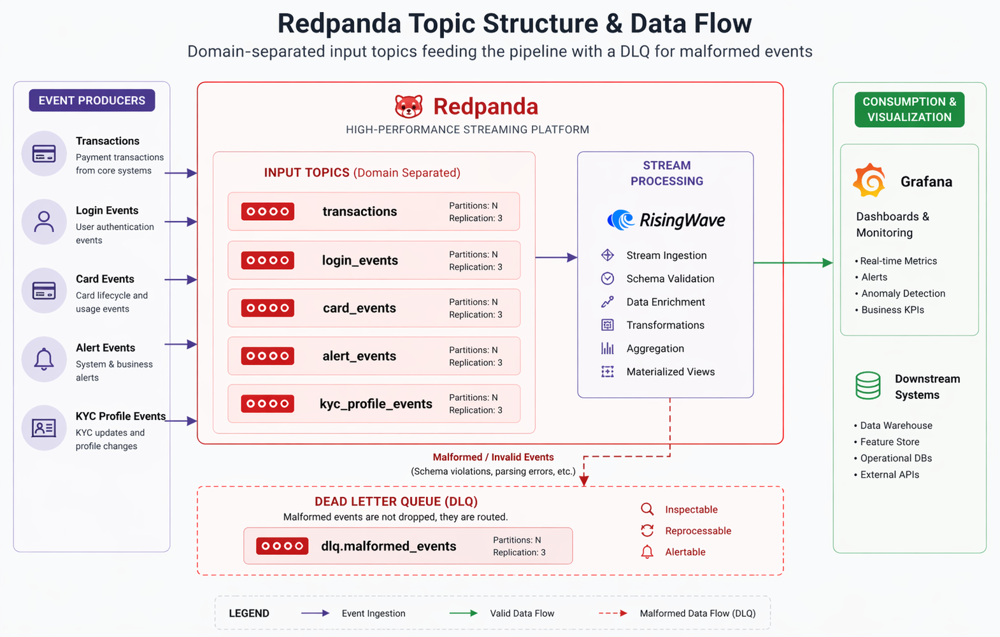
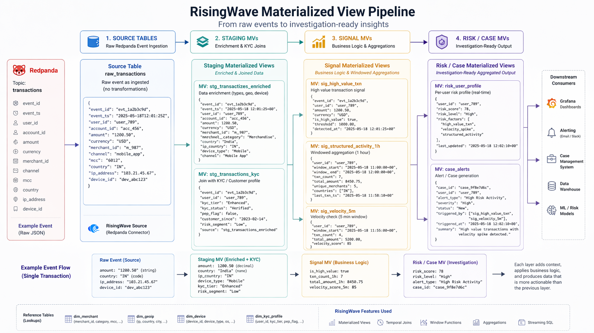
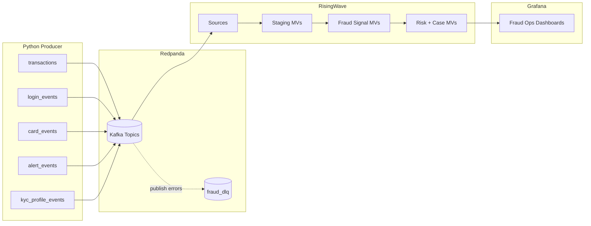

# Real-Time Fraud Detection Streaming Reference

Production-oriented, local-first reference architecture for **real-time fraud detection** using:
- **Redpanda** for event transport (Kafka API)
- **RisingWave** for continuous SQL and materialized views
- **Grafana** for operational dashboards
- **Python producer** for synthetic banking event generation

> Designed for platform engineering and fraud analytics teams who need a runnable streaming baseline with clear lineage, observability, and extensible detection rules.

---

## 1) Project Overview

This repository simulates a banking fraud environment end-to-end:

1. Producer emits transactions, logins, card events, alerts, and KYC updates.
2. Redpanda topics buffer and distribute events.
3. RisingWave consumes topics into source tables and computes staged + detection + risk views.
4. Grafana queries RisingWave directly for live fraud operations dashboards.

The pipeline includes signal logic for:
- Velocity bursts
- Geographic impossibility
- Account takeover indicators
- Card-not-present spikes
- Brute-force login storms
- Structuring / smurfing
- Correlated multi-alert bursts

---

## 2) High-Level Architecture

### Redpanda Topic Structure & Data Flow



Domain-separated input topics feed the pipeline. Malformed events are routed to a Dead Letter Queue (`dlq.malformed_events`) rather than dropped.

### RisingWave Materialized View Pipeline



Four SQL layers transform raw Redpanda events into investigation-ready insights: Sources → Staging MVs (enrichment & KYC joins) → Signal MVs (business logic & windowed aggregations) → Risk/Case MVs (per-account risk scores and open case alerts).



For deeper system design, see:
- `docs/architecture.md`
- `docs/data_flow.md`
- `docs/components.md`

---

## 3) Repository Structure

```text
.
├── docker-compose.yml             # Service orchestration
├── Makefile                       # Developer workflow targets
├── fraud_detection/               # dbt project for RisingWave models
│   ├── models/                    # dbt models (sources, staging, signals, risk, cases)
│   ├── dbt_project.yml            # dbt project configuration
│   └── profiles.yml               # RisingWave connection profile
├── producers/                     # Python event producer
│   ├── generators/                # Synthetic event generation modules
│   ├── tests/                     # Unit tests for generators + producer logic
│   └── main.py                    # Multi-threaded producer runtime
├── grafana/                       # Provisioned datasource + dashboards
├── scripts/                       # Health check and utility scripts
└── docs/                          # Architecture + ops documentation
```

---

## 4) Quick Start (Local)

### Prerequisites
- Docker Engine + Docker Compose v2
- `make`

### Bring up stack

```bash
git clone https://github.com/alwyndsouza/rp-dbt-rw-fraud-monitor
cd rp-dbt-rw-fraud-monitor
make up
```

Wait 90–120 seconds, then validate:

```bash
make validate
```

### Service URLs
- Redpanda Console: http://localhost:8080
- RisingWave Dashboard: http://localhost:5691
- Grafana: http://localhost:3000 (`admin` / `admin` by default)
- Producer health: http://localhost:8001/health

---

## 5) Development Workflow

### Core commands

```bash
make status         # container health + key view counts
make logs           # follow all logs
make logs-producer  # producer logs only
make kpis           # latest KPI rows
make risk           # critical risk accounts
make cases          # open fraud investigation cases
make psql           # SQL shell to RisingWave
```

### Python tests / lint

**Easiest - run all CI checks at once:**
```bash
make ci
```

**Individual commands:**
```bash
# Run pytest (from producers directory with uv)
cd producers && uv run pytest tests -q && cd ..

# Run ruff linting
uv run ruff check producers

# Run SQL validation checks
python3 scripts/ci_sql_checks.py

# Run dbt tests (requires Docker + RisingWave running)
docker run --rm \
  --network rp-dbt-rw-fraud-monitor_fraud-net \
  -v $(pwd)/fraud_detection:/dbt \
  -e RISINGWAVE_HOST=risingwave \
  python:3.11-slim \
  sh -c 'pip install dbt-risingwave==1.9.7 --quiet 2>&1 >/dev/null && cd /dbt && dbt test --profiles-dir .'
```

**Prerequisites:**
- Install dependencies: `uv sync --group dev` (root) and `cd producers && uv sync --extra dev`
- Ensure Docker network `rp-dbt-rw-fraud-monitor_fraud-net` exists (run `make up` first)

---

## 6) Configuration

Configuration is environment-variable driven (via `.env` and compose overrides).

Common knobs:
- `FRAUD_RATE` (default `0.10`)
- `TRANSACTION_RATE` (default `20`)
- `LOGIN_RATE`, `CARD_RATE`, `ALERT_RATE`, `KYC_RATE`
- `CUSTOMER_POOL_SIZE` (default `500`)
- `STRUCTURING_THRESHOLD` (default `10000`)
- `MINUTE_TICK_ENABLED` and minute tick batch sizes
- `ALERT_WORKERS` and `ALERT_QUEUE_SIZE` for bounded reactive alert processing
- `REDPANDA_SECURITY_PROTOCOL`, `REDPANDA_SASL_*` for secured broker auth in shared/prod environments

Use `.env.example` as baseline. `make up` will create `.env` if missing.

---

## 7) Deployment Notes (Production)

This repo is optimized for local and sandbox environments; for production:

1. **Pin versions** instead of `:latest` images in `docker-compose.yml`.
2. **Externalize secrets** (Grafana admin credentials, broker auth).
3. **Enable broker security** (TLS/SASL) and network segmentation.
4. **Use managed storage + backups** for Redpanda/RisingWave/Grafana state.
5. **Set resource limits / autoscaling** based on event throughput SLOs.
6. **Run CI gates** (lint/tests + SQL checks) on every PR.

A practical migration path is Kubernetes with:
- StatefulSets for broker/stream DB
- sealed-secrets/external-secrets
- Prometheus + alerting for lag, MV freshness, and DLQ growth

---

## 8) Observability & Operations

- Producer liveness endpoint: `/health`
- End-to-end smoke test: `scripts/check_pipeline.sh` (`make validate`)
- Data-quality guardrails: `make dq` (freshness, duplicates, null-key checks)
- Grafana dashboards pre-provisioned from `grafana/dashboards/`

Recommended SLO indicators:
- event ingest lag
- materialized-view freshness
- fraud signal latency
- DLQ publish failure rate
- critical-risk case backlog

---

## 9) Documentation Index

- `docs/architecture.md` — detailed system architecture
- `docs/data_flow.md` — lineage, transformations, and model layers
- `docs/components.md` — component-by-component reference
- `docs/troubleshooting.md` — common failure modes and fixes
- `docs/runbook.md` — operational procedures
- `docs/fraud_patterns.md` — business + regulatory context for each signal

---

## 10) Contributing

See `CONTRIBUTING.md` for:
- coding standards
- branch/PR strategy
- review checklist

---

## 11) CI Pipeline

GitHub Actions CI runs:
- `ruff` and `pytest` on Python 3.11
- dbt model compilation and validation
- smoke checks for compose config and data-quality artifacts

Workflow file: `.github/workflows/ci.yml`.
