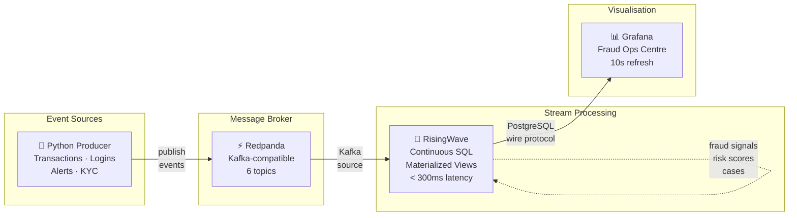

# Architecture Overview

## High-Level Architecture



## System Components

The fraud detection pipeline consists of five Docker services connected on a single bridge network (`fraud-net`):

```
┌─────────────────────────────────────────────────────────────────┐
│                        fraud-net (bridge)                        │
│                                                                   │
│  ┌─────────────┐    ┌──────────────┐    ┌────────────────────┐  │
│  │  producer   │───▶│   redpanda   │───▶│    risingwave      │  │
│  │  (Python)   │    │  (broker)    │    │ (stream processor) │  │
│  └─────────────┘    └──────┬───────┘    └────────┬───────────┘  │
│                            │                      │              │
│                    ┌───────▼───────┐    ┌────────▼───────────┐  │
│                    │redpanda-console│   │      grafana        │  │
│                    │  (UI :8080)  │    │   (UI :3000)        │  │
│                    └───────────────┘    └────────────────────┘  │
└─────────────────────────────────────────────────────────────────┘
```

### Event Flow

1. **Producer** generates synthetic banking events at configured rates and publishes to Redpanda topics
2. **Redpanda** brokers events across 6 topics with configurable partition counts
3. **RisingWave** continuously consumes from all topics via Kafka sources, maintaining 18 materialized views in real time
4. **Grafana** queries RisingWave directly via its PostgreSQL datasource (port 4566); the datasource and dashboard are auto-provisioned from `grafana/provisioning/` at container startup

### Initialisation Sequence

```
redpanda (healthy)
    └─▶ seed-topics (creates 6 topics)
    └─▶ redpanda-console (starts UI)
    └─▶ risingwave (healthy)
            └─▶ risingwave-init (executes SQL files 01→05)
                    └─▶ producer (starts event generation)
risingwave (healthy)
    └─▶ grafana (loads provisioned datasource + dashboard, starts UI)
```

## Data Pipeline Layers

### Layer 1: Kafka Sources (`01_sources.sql`)
Raw JSON ingestion from Redpanda. All fields arrive as `VARCHAR` — timestamps are stored as ISO-8601 strings at this layer. Five sources: `transactions`, `login_events`, `card_events`, `alert_events`, `kyc_profile_events`.

### Layer 2: Staging MVs (`02_staging.sql`)
Type casting and derived indicator columns. Converts `VARCHAR` timestamps to `TIMESTAMPTZ`. Adds computed boolean fields: `is_odd_hours`, `is_cnp`, `is_high_risk_mcc`. Also maintains `mv_latest_kyc` — a DISTINCT ON view giving the most recent KYC record per customer.

### Layer 3: Fraud Signal MVs (`03_fraud_signals.sql`)
Seven independent fraud detection patterns, each a materialized view. These are the core detection layer — self-contained, independently queryable, and directly corresponding to real-world fraud typologies documented in `docs/fraud_patterns.md`.

### Layer 4: Risk Aggregation MVs (`04_risk_aggregations.sql`)
Combines all signal views into account-level risk scores, operational KPIs, and dimensional breakdowns (by merchant, channel, and hour). These are the primary query targets for Grafana dashboards and API consumers.

### Layer 5: Case Management MVs (`05_case_management.sql`)
The investigation queue — surfaces accounts in HIGH/CRITICAL risk state with recommended actions, cross-joined against KYC risk tiers. Supports analyst workflow and automated action triggers (card block, account freeze, escalation).

## Key Design Decisions

### Tumbling vs Sliding Windows
The pipeline uses `TUMBLE()` windows throughout rather than `HOP()` (sliding) windows. Tumbling windows are more cache-friendly in RisingWave and produce cleaner aggregation boundaries, which matters for KPI reporting (you want clean 1-minute periods). The trade-off is that a fraud event straddling a window boundary may not be detected until the next window closes. For the latency targets of this pipeline (< 5min for velocity, CNP spike) this is acceptable.

### LAG() for Geo Detection
Geographic impossibility is the only pattern that requires comparing event pairs rather than windowed aggregates. RisingWave's LAG() analytic function over a customer-partitioned stream provides this comparison with low latency and no explicit join.

### Additive Risk Scoring
The risk score formula uses simple additive weights rather than ML-based scoring for two reasons: (1) interpretability — compliance teams must be able to explain to regulators exactly why an account was flagged, and (2) reproducibility — the `contributing_signals` array makes the reasoning fully auditable.

### No Separate OLAP Engine
RisingWave serves dual roles: stream processor AND query-serving database. This eliminates the typical complexity of maintaining a separate Redis or ClickHouse layer for serving pre-computed results. The PostgreSQL wire protocol compatibility means any BI tool (Grafana, Tableau, Metabase) can query RisingWave directly with zero additional infrastructure.

## Architecture Risks and Improvement Opportunities

1. **Floating container tags (`latest`)**
   - Risk: non-deterministic upgrades and runtime drift.
   - Improvement: pin image tags and automate periodic dependency bump PRs.

2. **Single-node topology**
   - Risk: no fault tolerance for broker/stateful stream storage.
   - Improvement: run multi-node Redpanda and production-grade RisingWave deployment.

3. **Security defaults optimized for local demo**
   - Risk: plain-text broker connections and default Grafana credentials.
   - Improvement: TLS/SASL, secret manager integration, and network policy restrictions.

4. **Limited automated data contracts**
   - Risk: schema drift can silently degrade downstream views.
   - Improvement: add CI checks that validate topic payload schemas against SQL source definitions.

5. **Per-event reactive alert thread creation**
   - Risk: burst fraud scenarios can create many short-lived threads.
   - Improvement: replace per-alert thread spawning with a bounded worker queue / thread pool.
